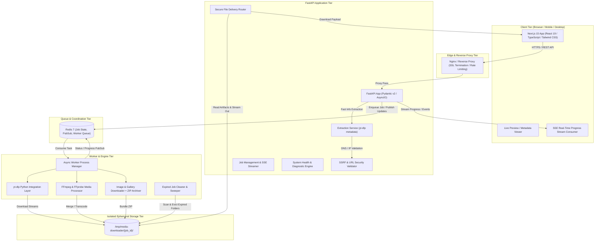
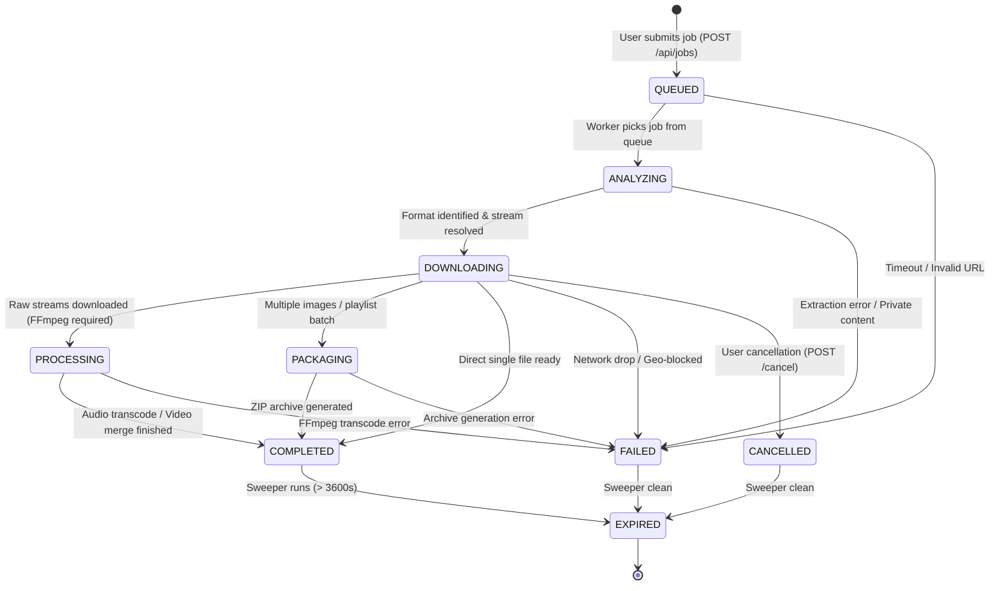
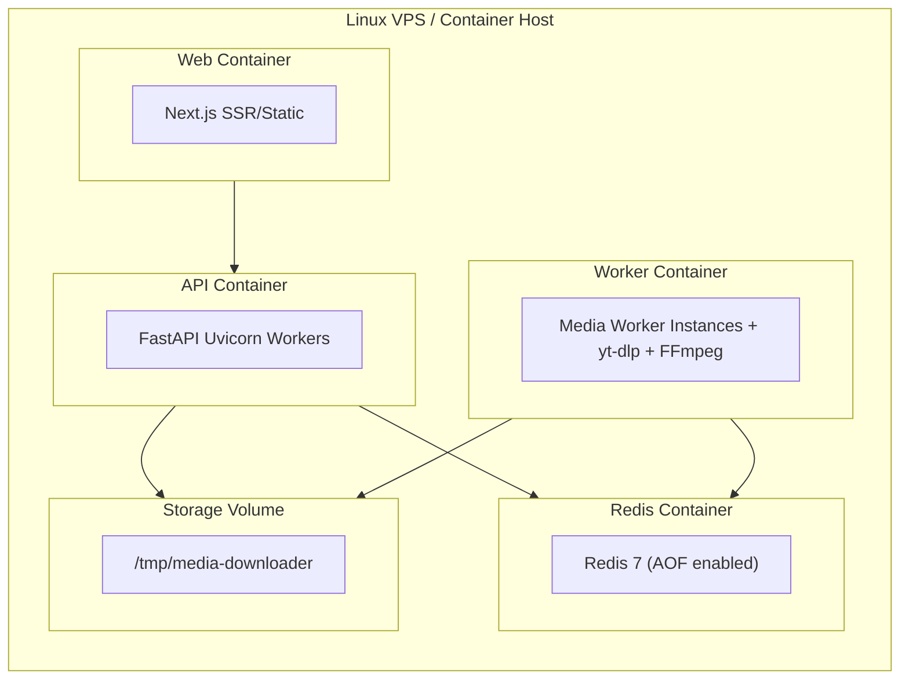

# Universal Media Downloader — Architecture Specification

## 1. Executive Summary & System Overview

The **Universal Media Downloader** is an enterprise-grade, privacy-first, and high-performance media extraction and downloading platform. Built atop the modern `yt-dlp` extraction engine and `FFmpeg` processing pipeline, the system allows users to extract, convert, package, and download video, audio, image galleries, and playlists seamlessly from thousands of supported web sources.

### Core Design Principles
1. **Real Media Operations Only**: No synthetic mocks, fake progress counters, or client-side illusions. Every URL triggers real validation, extraction, background job scheduling, post-processing, and streaming HTTP downloads.
2. **Strict Subprocess & Network Isolation (SSRF & Command Injection Immunity)**: User-provided URLs and format parameters are strictly validated against IP ranges, DNS resolution targets, and sanitized argument lists.
3. **Asynchronous, Non-Blocking Architecture**: FastAPI delegates heavy downloading, merging, and transcoding to Redis-backed background worker queues. Progress is streamed in real time via Server-Sent Events (SSE).
4. **Zero-Trace Storage & Auto-Cleanup**: Every job receives an isolated, cryptographically generated workspace directory. An automatic sweeper daemon expires and unlinks all media, fragments, and metadata files upon completion or timeout.
5. **Universal Client Support**: Pure HTTP/1.1 and HTTP/2 standards-compliant file distribution with accurate `Content-Disposition`, `Content-Length`, and MIME types, eliminating filesystem leaks or internal path exposure.

---

## 2. High-Level Architecture Topology



---

## 3. Component Architecture & Responsibilities

### 3.1 Frontend (`apps/web`)
* **Framework**: Next.js 15 (App Router), React 19, TypeScript (Strict).
* **Styling & UI**: Tailwind CSS, Radix UI primitives (`shadcn/ui`), Framer Motion micro-animations, Lucide React icons.
* **Responsibilities**:
  * Input sanitization, immediate client-side URL parsing.
  * Instant feedback & extraction triggering (`POST /api/extract`).
  * Dynamic format cards categorized into **Video** (with resolution, bitrate, container), **Audio** (MP3, M4A, Opus, FLAC, WAV, custom bitrates), and **Images / Gallery** (with thumbnail previews, individual selection, bulk ZIP download).
  * Direct-to-consumer SSE progress bar subscribing to `/api/jobs/{job_id}/events`.
  * Triggering standard native browser download dialog via `/api/download/{job_id}` without exposing backend filenames or server directory paths.

### 3.2 Backend API (`apps/api`)
* **Framework**: FastAPI (Python 3.12+ / 3.14+), Pydantic v2 schemas, Starlette.
* **Responsibilities**:
  * **SSRF Guard**: Pre-flight resolution of all user hostnames, denying private IP networks, loopbacks, link-local, cloud metadata IP (`169.254.169.254`), and IPv6 equivalents.
  * **Extraction Controller**: High-speed metadata parsing using `yt-dlp` in non-download mode (`extract_flat=False`, `process=True`).
  * **Job Controller**: Job ticket creation, queuing in Redis, immediate UUID assignment.
  * **SSE Broadcaster**: Asynchronous Redis PubSub bridge streaming JSON-formatted lifecycle events directly to connected clients.
  * **Secure Download Streamer**: `FileResponse` / `StreamingResponse` provider with strict RFC 5987 / RFC 6266 `Content-Disposition` header encoding, automatic MIME resolution, and cache-control disabling.
  * **Health & Diagnostics**: Real-time probing of Redis connectivity, `yt-dlp` executable/package version, `ffmpeg`/`ffprobe` binaries, and disk quota headroom.

### 3.3 Worker & Media Processing Engine (`apps/worker`)
* **Runner**: Python Async Worker backed by Redis queue & PubSub.
* **Sub-Services**:
  * **`YtDlpService`**: Wraps `yt_dlp.YoutubeDL` with standard hook handlers (`progress_hooks`, `postprocessor_hooks`). Converts internal progress states into normalized percentage, downloaded bytes, throughput speed (B/s), ETA (seconds), and active sub-stages.
  * **`FFmpegService`**: Manages audio extraction (`ffmpeg -i ... -vn -c:a libmp3lame -b:a 320k`), stream multiplexing (`ffmpeg -i video.mp4 -i audio.m4a -c:v copy -c:a aac output.mp4`), and thumbnail extraction without invoking arbitrary shell strings.
  * **`ImageService`**: Concurrent HTTP fetching of gallery resources, format normalization, and streaming Zip creation via Python's standard `zipfile` module.
  * **`CleanupService`**: Sweeps `/tmp/media-downloader/` every minute, removing directories older than `DOWNLOAD_EXPIRY_SECONDS` (default: 3600s) and scrubbing temporary files on job failure.

---

## 4. Job State Machine & Progress Pipeline



### Job Progress Data Model
```json
{
  "job_id": "8c2f106e-1d54-469b-8e1f-7bb90a88e999",
  "status": "DOWNLOADING",
  "url": "https://example.com/watch?v=123",
  "media_type": "video",
  "title": "Clean Title Here",
  "thumbnail": "https://...",
  "progress": 64.5,
  "speed": 5242880,
  "eta": 12,
  "downloaded_bytes": 33554432,
  "total_bytes": 52000000,
  "stage_message": "Downloading video stream (1080p)...",
  "filename": "Clean_Title_Here.mp4",
  "mime_type": "video/mp4",
  "created_at": "2026-10-01T22:00:00Z",
  "started_at": "2026-10-01T22:00:01Z",
  "completed_at": null,
  "expires_at": "2026-10-01T23:00:01Z",
  "error_code": null,
  "error_message": null
}
```

---

## 5. Storage & File System Lifecycle Architecture

```
/tmp/media-downloader/
│
├── 8c2f106e-1d54-469b-8e1f-7bb90a88e999/       [Job Directory: Isolated]
│   ├── meta.json                                [Job state & metadata]
│   ├── raw_video.f137.mp4                       [Temporary video stream]
│   ├── raw_audio.f140.m4a                       [Temporary audio stream]
│   └── output.mp4                               [Merged final file]
│
├── 3f1b402a-9e12-411a-b33c-09de5488bc12/       [Image Gallery Job]
│   ├── 01-image.jpg
│   ├── 02-image.png
│   ├── 03-image.webp
│   └── images.zip                               [Final archive for user download]
│
└── lock/
    └── sweeper.lock                             [Concurrent cleanup mutex]
```

1. **Isolation**: Every job operates exclusively within its own directory `/tmp/media-downloader/{job_id}`.
2. **Permission Boundary**: Files are written with strict POSIX `0700` directory and `0600` file permissions.
3. **No Direct Static Serving**: The filesystem path is never routed directly via a static file server. All downloads pass through the authenticated/validated `/api/download/{job_id}` controller.
4. **Cleanup Daemon**:
   - On job completion: Timer scheduled for eviction (`DOWNLOAD_EXPIRY_SECONDS`).
   - On job failure: Immediate cleanup of raw/partial `.part` or `.ytdl` files.
   - Periodic Sweep: Runs every 60 seconds to prune orphan folders.

---

## 6. Security Architecture & Threat Matrix

| Threat Vector | Mitigation Strategy |
| :--- | :--- |
| **Server-Side Request Forgery (SSRF)** | Pre-resolution of DNS hostname to IP; check against `RFC 1918`, `RFC 3927`, `RFC 4291`, loopback (`127.0.0.0/8`, `::1`), link-local (`169.254.0.0/16`, `fe80::/10`), multicast (`224.0.0.0/4`). Followed redirects are re-validated before fetching. |
| **Command Injection** | Zero shell executions (`shell=False`). Subprocesses (`ffmpeg`, `yt-dlp`) are invoked using explicit argument arrays `["ffmpeg", "-i", ...]` with strict parameter type checking. |
| **Path Traversal / Overwrite** | Filenames are stripped of path separators (`/`, `\`), null bytes (`\0`), control characters, and reserved Windows filenames (`CON`, `PRN`, `AUX`, `NUL`, `COM1-9`, `LPT1-9`). Only alphanumeric, unicode, dashes, underscores, and dots are retained. |
| **Denial of Service / Resource Exhaustion** | 1. Rate limiting per IP on `/api/extract` and `/api/jobs`.<br>2. Hard ceiling on max file size (`MAX_FILE_SIZE = 5GB`).<br>3. Hard limit on playlist items (`MAX_PLAYLIST_ITEMS = 50`).<br>4. Job timeout limit (`MAX_JOB_DURATION = 900s`).<br>5. Max concurrent worker threads per instance. |
| **Internal Path / UUID Leakage** | Download responses strip internal paths, exposing only sanitised user-friendly filenames via standard `Content-Disposition: attachment; filename="..."` headers. |

---

## 7. yt-dlp Integration Layer Specification

The integration with `yt-dlp` is encapsulated inside `YtDlpService` to allow independent upstream library upgrades without breaking application code.

### Python API Integration Points
1. **Extraction (Metadata Only)**:
   ```python
   ydl_opts = {
       "extract_flat": False,
       "skip_download": True,
       "quiet": True,
       "no_warnings": True,
       "ignoreerrors": False,
       "socket_timeout": 15,
   }
   ```
2. **Download & Hooking**:
   ```python
   ydl_opts = {
       "format": selected_format_spec,
       "outtmpl": f"{job_dir}/%(title).200B.%(ext)s",
       "progress_hooks": [self._handle_progress_event],
       "postprocessor_hooks": [self._handle_postprocessor_event],
       "quiet": True,
       "no_warnings": True,
       "max_filesize": settings.MAX_FILE_SIZE_BYTES,
       "concurrent_fragment_downloads": 4,
   }
   ```

---

## 8. Deployment & Production Topology



* **Frontend**: Next.js Standalone Node server / CDN.
* **API**: Multi-worker Uvicorn (`fastapi`).
* **Worker**: Dedicated CPU-bound container bundling `ffmpeg`, `ffprobe`, `yt-dlp`, and Node.js (for YouTube JS challenge solvers where required).
* **Storage**: Shared ephemeral Docker volume mounted at `/tmp/media-downloader`.
